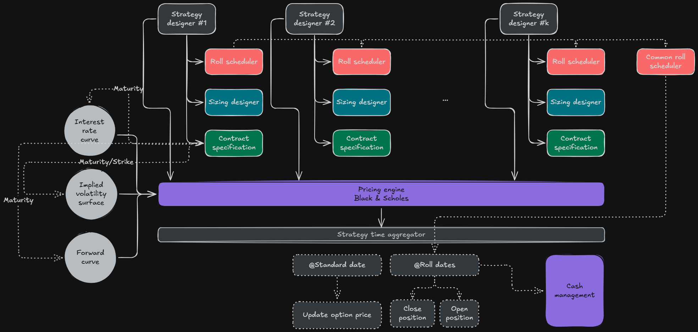

# FX Option Backtesting Engine

A modular backtesting framework for Foreign Exchange options using the Garman-Kohlhagen model.

## Features

- **Garman-Kohlhagen pricing** with full Greeks (Delta, Gamma, Vega, Theta, Rho)
- **Volatility surface** interpolation: cubic spline in strike, linear in time, **linear extrapolation**
- **Rate & forward curve** interpolation: linear interpolation and extrapolation
- **Multi-leg strategies**: Straddle, Call Ratio Spread, Calendar Spread
- **Daily delta hedging** with a spot hedge book, plus roll scheduling and per-strategy sizing
- **Performance analytics**: Sharpe, Sortino, Max Drawdown, VaR, CVaR
- **Greeks P&L attribution**: decompose daily P&L into Delta / Gamma / Vega / Theta
- **Signal integration**: gate entries with momentum or realised-vol filters

## Project Structure

```
src/
├── data/           # Market data loading (Parquet ingestion + pivot)
├── curves/         # Rate & forward curve interpolators (linear)
├── volatility/     # Vol surface (cubic spline + linear extrapolation)
├── pricing/        # Garman-Kohlhagen model + full Greeks
├── strategies/     # Straddle, CallRatioSpread, CalendarSpread, signals, sizing
├── portfolio/      # Option positions, cash, spot delta-hedge book
├── analytics/      # Performance metrics & Greeks P&L attribution
└── engine.py       # Main backtester orchestrator
notebooks/
└── backtester.ipynb  # End-to-end walkthrough
tests/              # Unit tests (pricing parity, interpolation, analytics)
data/               # Parquet market data (not committed)
outputs/            # Backtest artefacts: charts, CSV results (not committed)
docs/
└── USER_GUIDE.md   # Methodology + quantitative deep-dive
```

## Installation

```bash
poetry install
# or, without Poetry:
pip install pandas numpy scipy matplotlib seaborn pyarrow jupyter
```

## Quick Start

```python
from fx_backtester.engine import Backtester
from fx_backtester.strategies.straddle import Straddle

bt = Backtester("data")
bt.load_data()

strategy = Straddle(tenor_days=30, direction=1)
results = bt.run(strategy, start="2021-01-01", end="2024-12-31", notional=1_000_000)

print(results["metrics"])           # Sharpe, Sortino, VaR, CVaR, max drawdown, …
results["daily_pnl"].cumsum().plot()
```

`results` also exposes `components` (option vs hedge P&L), `greeks`, and
`attribution` (Delta/Gamma/Vega/Theta decomposition).

Run the full end-to-end walkthrough in [`notebooks/explore.ipynb`](notebooks/explore.ipynb),
and see the methodology in the [User Guide](docs/USER_GUIDE.md).

## Market Data

Four Parquet datasets (place in `data/`):

| File                          | Description                         |
| ----------------------------- | ----------------------------------- |
| `*spot*.parquet`              | Daily spot FX rates                 |
| `*forwardcurve*.parquet`      | Forward points by tenor             |
| `*depocurve*.parquet`         | Interest rates (domestic & foreign) |
| `*volatilitysurface*.parquet` | Implied vols by strike/tenor        |

## Strategies

| Strategy          | Description                               |
| ----------------- | ----------------------------------------- |
| `Straddle`        | Long ATM call + put — pure volatility bet |
| `CallRatioSpread` | Long 1 ATM call, short 2 OTM calls        |
| `CalendarSpread`  | Long far-dated, short near-dated option   |

## Testing

```bash
poetry run pytest        # or: py -m pytest
```

Covers put-call parity, Greek signs, curve/vol interpolation and extrapolation,
and the performance & attribution analytics.

## Architecture



Data layer (Parquet ingest + pivot) feeds curve interpolators and the cubic-spline
vol surface, which drive the Garman-Kohlhagen pricing engine. Per-strategy roll
schedulers, sizing and contract specs open/close legs; a daily loop marks the book
to market, **delta-hedges with spot**, and attributes P&L by Greek. See the
[User Guide](docs/USER_GUIDE.md) for the full component overview.


